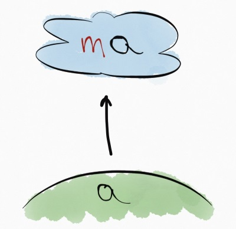

- title : Funkyjna kompozycja
- description : 
- author : Łukasz Kaczanowski
- theme : night
- transition : default

### Funkcyjna kompozycja

***

### Higher Order Functions

***

### Compose

    let compose f g x = g (f x)

    let (>>) = compose

***

### Życie w chmurze
#### aka Elevated World

***

### Functor

    [lang=haskell]
    fmap :: (a -> b) -> m a -> m b

---

### Functor
#### List

    [lang=haskell]
    fmap :: (a -> b) ->  [a]  -> [b]

---

### Functor
#### Option

    [lang=haskell]
    fmap :: (a -> b) -> Option a -> Option b

---

### Functor
#### Task

    [lang=haskell]
    fmap :: (a -> b) -> Task a -> Task b

***

### Przestrzeganie reguł

---

### Prawo toższamości
#### Identity law
> Zapewnia, że functor nie będzie robił, żadnych dodatkowych zmian i efektów ubocznych. Zmiany robi tylko aplikowana funkcja.

    [lang=haskell]
    fmap id a = id a

***

### Applicative

    [lang=haskell]
    pure  :: a -> m a
    apply :: m (a -> b) -> m a -> m b

***

### Monad

    [lang=haskell]
    bind :: (a -> m b) -> m a -> m b

***

### Bonus : Kleisli

    [lang=haskell]
    arrow :: (a -> m b) -> (b -> m c) -> m a -> m c

***

### Podsumowanie

    [lang=haskell]
    fmap  ::   (a ->   b) -> m a -> m b
    apply :: m (a ->   b) -> m a -> m b
    bind  ::   (a -> m b) -> m a -> m b
***

### Linki

[http://fsharpforfunandprofit.com/](http://fsharpforfunandprofit.com/)
